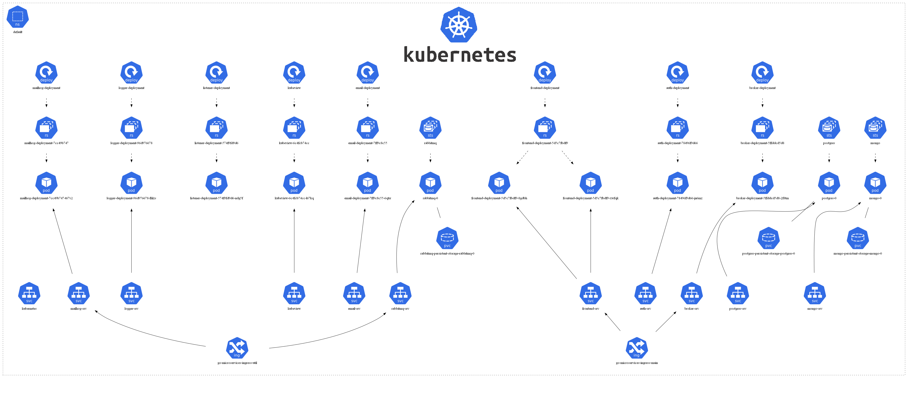

# Building Distributed Microservices in Go with Kubernetes

This repository contains a Go-based microservices project that focuses on exploring various aspects of microservice architecture and distributed deployment using Kubernetes. The project aims to achieve the following goals:

### Goals

This project has the task of achieving 3 specific goals:

1. **Building Microservice Architecture in GO**: This project provides a hands-on experience with building microservices in Go, allowing for an in-depth analysis of their behavior, specific characteristics, potential drawbacks, and performance considerations.

2. **Inter-Process Communication Patterns:** The project explores different types of inter-process communication patterns commonly used in microservices. It delves into the specifics, use cases, drawbacks, and performance of the following communication patterns:

    - Standard JSON-based communication format
    -  Go-based pure RPC communication
    - gRPC communication with protobuf files
    - Communication through a message broker, specifically RabbitMQ using the AMQP protocol

3. **Distributed Deployment with Kubernetes:** The microservices are deployed in a distributed environment using Docker containers and Kubernetes. This allows for testing the functionality and performance of the microservices within a cluster and assessing how the different communication channels perform in this setup.

### Architecture

The architecture of the project consists of the following components:

1. **Logger Microservice:** Listens on both HTTP and RPC and logs data to a local MongoDB. It provides logging capabilities for other microservices.

2. **Auth Service:** Stores user credentials in a local Postgres database and performs authentication. When a user successfully authenticates, it sends an RPC payload to the Logger service.

3. **Email Service:** Listens on both HTTP and gRPC and uses a local MailHog instance as a development SMTP server. It handles the sending of emails for the application.

4. **Listener Service:** Consumes messages from a RabbitMQ queue. It acts as a router, receiving messages that include an endpoint(microservice) and corresponding data. The Listener service then calls the appropriate microservice based on the endpoint.

5. **Broker Service:** This service acts as a gateway to all other microservices within the architecture. It communicates internally with other microservices, providing various functionalities. It can authenticate users by calling the Auth microservice via HTTP, log data by calling the Logger service via HTTP, send messages to RabbitMQ for further processing, and send emails by directly sending data to the Email service via gRPC.

6. **Basic Frontend Service:** A simple frontend service that communicates with the Broker service. It serves as the user interface for the application, interacting with the backend microservices.

These components work together to form a distributed microservices architecture, leveraging various communication protocols and technologies to handle authentication, logging, email sending, and message routing within the application.

## Docker-Compose
Used during initial development - to make it easier and faster to work with the containeraized microservices

## Kubernetes

Used MiniKube as a development cluster to build, test and analyze the behaviour of the system.

The Kubernetes architecture for the project includes the following components:

1. **Deployments:** Each of the microservices (Email, Listener Service, Broker, FE, Auth, Logger, Mailhog) is deployed as a separate Kubernetes Deployment. Deployments provide scalable and reliable management of the application's containers.

2. **StatefulSets:** StatefulSets are used for deploying stateful applications, such as MongoDB, Postgres, and RabbitMQ. StatefulSets ensure stable network identities and persistent storage for each instance of the stateful application.

3. **Secrets:** Secrets are used to securely store sensitive information, such as passwords, API keys, and certificates. Each microservice has its own secret to manage and protect its specific credentials and configuration.

4. **Ingress Controllers:** Two Ingress controllers are employed in the architecture. The first Ingress controller is responsible for exposing the frontend (FE) service at the root path ("/") and the Broker service at the "/api" path. All other microservices are internal and not exposed to the outside world. The second Ingress controller is used to expose the UI Monitoring Dashboards for RabbitMQ (rabbit.localhost) and MailHog (mailhog.localhost). This allows easy access to monitoring and administration interfaces for these components.

## K8s Cluster Diagram

